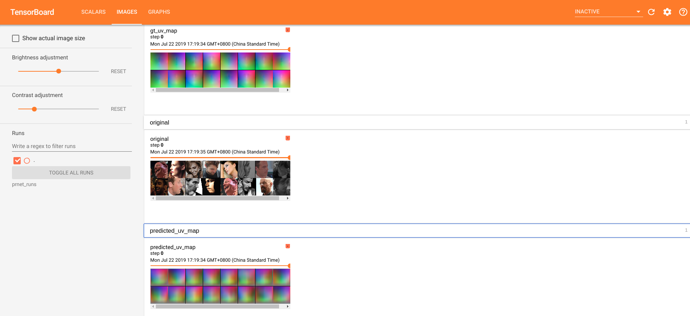
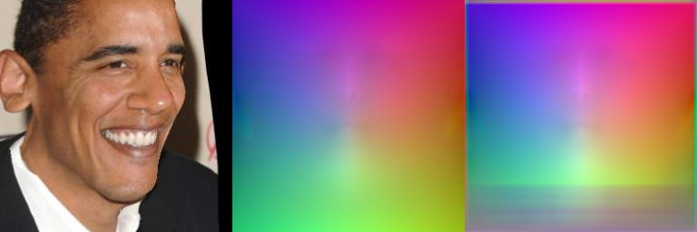

# PRNet PyTorch 1.1.0


<p align="center"> 

</p>

This is an unofficial pytorch implementation of **PRNet** since there is not a complete generating and training code
of [`300WLP`](http://www.cbsr.ia.ac.cn/users/xiangyuzhu/projects/3DDFA/main.htm) dataset.

### Citation

If you use this code, please consider citing:

```
@inProceedings{feng2018prn,
  title     = {Joint 3D Face Reconstruction and Dense Alignment with Position Map Regression Network},
  author    = {Yao Feng and Fan Wu and Xiaohu Shao and Yanfeng Wang and Xi Zhou},
  booktitle = {ECCV},
  year      = {2018}
}
```

### Noitce

As we adopt replace the default `PIL.Imgae` by `cv2.imread` in image reader, you need
do a little revise on your tensorboard packages in `your_python_path/site-packages/torch/utils/tensorboard/summary.py`

What you should do is add `tensor = tensor[:, :, ::-1]` before `image = Image.fromarray(tensor)` in function `make_image(...)`.
```shell
...
def make_image(tensor, rescale=1, rois=None):
    """Convert an numpy representation image to Image protobuf"""
    from PIL import Image
    height, width, channel = tensor.shape
    scaled_height = int(height * rescale)
    scaled_width = int(width * rescale)

    tensor = tensor[:, :, ::-1]
    image = Image.fromarray(tensor)
    ...
...
``` 

----
## ① Pre-Requirements 

Before we start generat uv position map and train it. The first step is generate BFM.mat according to [Basel Face Model](https://faces.dmi.unibas.ch/bfm/).
For simplicity, The corresponding `BFM.mat` has been provided [here](https://drive.google.com/open?id=1Bl21HtvjHNFguEy_i1W5g0QOL8ybPzxw).

After download it successfully, you need to move `BFM.mat` to `utils/`.

Besides, the essential python packages were listed in `requirements.txt`.

## ② Generate uv_pos_map

[YadiraF/face3d](https://github.com/YadiraF/face3d) have provide scripts for generating uv_pos_map, here i wrap it for 
Batch processing.

You can use `utils/generate_posmap_300WLP.py` as:

``` shell
python3 generate_posmap_300WLP.py --input_dir ./dataset/300WLP/IBUG/ --save_dir ./300WLP_IBUG/
```

Then `300WLP_IBUG` dataset is the proper structure for training PRNet:

```
- 300WLP_IBUG
 - 0/
  - IBUG_image_xxx.npy
  - original.jpg (original RGB)
  - uv_posmap.jpg (corresponding UV Position Map)
 - 1/
 - **...**
 - 100/ 
```

Except from download from [`300WLP`](http://www.cbsr.ia.ac.cn/users/xiangyuzhu/projects/3DDFA/main.htm),
I provide processed *original--uv_posmap* pair of IBUG [here](https://drive.google.com/open?id=16zZdkRUNdj7pGmBpZIwQMA00qGHLLi94).

## ③ Training
After finish the above two step, you can train your own PRNet as:

``` shell

python3 train.py --train_dir ./300WLP_IBUG
```

You can use tensorboard to visualize the intermediate output in `localhost:6006`:
```shell
tensorboard --logdir=absolute_path_of_prnet_runs/
```



The following image is used to judge the effectiveness of PRNet to unknown data.

(Original, UV_MAP_gt, UV_MAP_predicted)


## ④ Inference(To be continued)